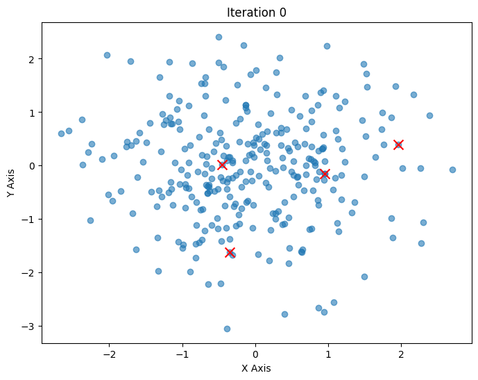

# K-means Clustering Implementation with NumPy

## Overview
This project implements the K-means clustering algorithm from scratch using NumPy. It demonstrates the fundamental concepts of cluster analysis through a simple 2D visualization.

## Introduction to K-means Clustering
K-means clustering is a popular unsupervised machine learning algorithm used to partition a dataset into k distinct, non-overlapping subsets or clusters. The goal is to group data points in such a way that points in the same cluster are more similar to each other than to those in other clusters.

### How K-means Works
1. **Initialization**: Randomly select k initial centroids from the data points.
2. **Assignment**: Assign each data point to the nearest centroid, forming k clusters.
3. **Update**: Recalculate the centroids as the mean of all data points assigned to each cluster.
4. **Repeat**: Repeat the assignment and update steps until the centroids no longer change significantly or a maximum number of iterations is reached.

### Mathematical Formulation
The K-means algorithm aims to minimize the within-cluster sum of squares (WCSS), also known as inertia. Mathematically, it can be expressed as:
\[ \text{WCSS} = \sum_{i=1}^{k} \sum_{x \in C_i} \| x - \mu_i \|^2 \]
where \( C_i \) is the set of points in cluster i, and \( \mu_i \) is the centroid of cluster i.

### Advantages and Limitations
**Advantages**:
- Simple and easy to implement
- Efficient for large datasets
- Works well with spherical clusters

**Limitations**:
- Requires the number of clusters (k) to be specified in advance
- Sensitive to initial centroid positions
- May converge to local optima
- Not suitable for clusters with non-spherical shapes or varying densities

## Dependencies
- NumPy
- Matplotlib

## Implementation Details

The implementation consists of two main components:

1. Data Generation and Definition for Number of Clusters
```python
import numpy as np
import matplotlib.pyplot as plt

k = 4  # Number of clusters
np.random.seed(0)
data = np.random.randn(300, 2)
```
First, the code imports the necessary libraries. `numpy` is imported as `np`, which is a common alias used to simplify the usage of the library. NumPy is a powerful library for numerical computing in Python, providing support for arrays, matrices, and many mathematical functions. `matplotlib.pyplot` is imported as `plt`, another common alias. Matplotlib is a plotting library used for creating static, interactive, and animated visualizations in Python.

Next, the variable `k` is defined and set to `4`. This variable represents the number of clusters that the K-means algorithm will attempt to find in the dataset. K-means clustering is an unsupervised learning algorithm that partitions a dataset into `k` distinct, non-overlapping subsets (clusters).

The line `np.random.seed(0)` sets the seed for NumPy's random number generator. Setting the seed ensures that the random numbers generated are reproducible, which is important for debugging and consistency in experiments. By using the same seed, you can ensure that the same random numbers are generated each time the code is run.

Finally, the `data` variable is created using `np.random.randn(300, 2)`. This function generates a 300x2 array of random numbers drawn from a standard normal distribution (mean of 0 and standard deviation of 1). This array represents the dataset that will be used for clustering. Each row in the array corresponds to a data point with two features.

2. Initializing the Centroids for the K-means Clustering Algorithm
```python
initial_indices = np.random.choice(len(data), k, replace=False)
centroids = data[initial_indices]
```
The line `initial_indices = np.random.choice(len(data), k, replace=False)` selects `k` unique indices from the dataset. The function` np.random.choice` is used to randomly choose `k` indices from the range of the dataset's length` (len(data))`. The parameter `replace=False` ensures that the same index is not selected more than once, guaranteeing that the chosen indices are unique.

The next line, `centroids = data[initial_indices]`, uses the randomly selected indices to initialize the centroids. By indexing the `data` array with `initial_indices`, it extracts the data points at those indices and assigns them as the initial centroids. These centroids serve as the starting points for the K-means algorithm.

3. 
```python
def plot_data(data, centroid, iteration, idx=None):
  plt.figure(figsize=(8, 6))
  if idx is not None:
    plt.scatter(data[:,0], data[:,1], c=idx, alpha=0.6, cmap='viridis')
  else:
    plt.scatter(data[:,0], data[:,1], alpha=0.6)
  plt.scatter(centroids[:, 0], centroids[:, 1], c='red', s=100, marker='x')
  plt.title(f"Iteration {iteration}")
  plt.xlabel("X Axis")
  plt.ylabel("Y Axis")
  plt.show()

plot_data(data,centroids, iteration=0)
```
The provided code snippet defines a function `plot_data` that visualizes the data points and centroids for the K-means clustering algorithm using Matplotlib.

The function `plot_data` takes four parameters: `data`, `centroids`, `iteration`, and an optional parameter `idx`. The `data` parameter represents the dataset, `centroids` represents the current positions of the centroids, `iteration` indicates the current iteration number of the K-means algorithm, and `idx` is an optional parameter that contains the cluster assignments for each data point.

Inside the function, `plt.figure(figsize=(8, 6))` creates a new figure with a specified size of 8x6 inches. This sets up the plotting area for the visualization.

The function then checks if the `idx` parameter is provided. If `idx` is `not None`, it means that cluster assignments are available. In this case, `plt.scatter(data[:,0], data[:,1], c=idx, alpha=0.6, cmap='viridis')` is used to create a scatter plot of the data points, where the color of each point corresponds to its cluster assignment.` The alpha=0.6` parameter sets the transparency level of the points, and `cmap='viridis'` specifies the colormap to use for coloring the points.

If `idx` is `None`, the function creates a scatter plot of the data points without coloring them by cluster assignment using `plt.scatter(data[:,0], data[:,1], alpha=0.6)`.

Next, `plt.scatter(centroids[:, 0], centroids[:, 1], c='red', s=100, marker='x')` adds a scatter plot of the centroids to the same figure. The centroids are plotted as red 'x' markers with a size of 100.

The function then sets the title of the plot to indicate the current iteration using `plt.title(f"Iteration {iteration}")`. It also labels the x-axis and y-axis with `plt.xlabel("X Axis")` and `plt.ylabel("Y Axis")`, respectively.

Finally, `plt.show()` displays the plot.

The last line, `plot_data(data, centroids, iteration=0)`, calls the `plot_data` function with the initial `data` and `centroids`, and sets the iteration number to 0. This generates and displays the initial plot of the data points and centroids before any iterations of the K-means algorithm have been performed.


4.
```python
for i in range(5): # Perform up to 5 iterations
  distances = np.linalg.norm(data[:, np.newaxis] - centroids, axis=2)
  closest = np.argmin(distances, axis=1)
  plot_data(data, centroids, iteration=i+1, idx=closest)
  new_centroids = np.array([data[closest == j].mean(axis=0) for j in range(k)])
  if np.allclose(centroids, new_centroids):
    break
  centroids = new_centroids

plot_data(data, centroids, iteration=i+1, idx=closest)
```
The `for` loop runs for a maximum of 5 iterations, as indicated by` for i in range(5)`. Each iteration represents a single step in the K-means algorithm, where the distances between data points and centroids are calculated, data points are assigned to the nearest centroid, and centroids are updated based on the mean of the assigned points.

Within the loop, `distances = np.linalg.norm(data[:, np.newaxis] - centroids, axis=2)` computes the Euclidean distances between each data point and each centroid. The expression `data[:, np.newaxis] - centroids` creates a new axis for broadcasting, allowing the calculation of distances between each data point and all centroids simultaneously. The `axis=2` parameter specifies that the norm should be computed along the last axis, resulting in a 2D array of distances.

The closest variable is determined using `np.argmin(distances, axis=1)`, which finds the index of the nearest centroid for each data point. This effectively assigns each data point to the closest cluster.

The function `plot_data(data, centroids, iteration=i+1, idx=closest)` is called to visualize the data points and centroids at the current iteration. The `idx` parameter contains the cluster assignments for each data point, allowing the plot to color the points based on their assigned clusters.

Next, `new_centroids = np.array([data[closest == j].mean(axis=0) for j in range(k)])` updates the centroids by calculating the mean of all data points assigned to each cluster. The list comprehension iterates over each cluster index `j` and computes the mean of the data points that belong to that cluster, resulting in an array of new centroids.

The condition `if np.allclose(centroids, new_centroids): break` checks if the centroids have converged. The `np.allclose` function compares the old and new centroids and returns `True` if they are approximately equal within a certain tolerance. If the centroids have not changed significantly, the loop breaks, indicating that the algorithm has converged.

If the centroids have not converged,` centroids = new_centroids` updates the centroids to the newly calculated positions, and the loop continues to the next iteration.

After the loop, `plot_data(data, centroids, iteration=i+1, idx=closest)` is called one final time to visualize the data points and centroids after the last iteration.

## Running the Code
```bash
python Kmeans_numpy.py
```

## Output



## Visualization
The script generates plots for each iteration, showing:
- Data points colored by cluster assignment
- Cluster centroids marked with red X's
- Progress of the clustering algorithm


## Learning Outcomes
- Understanding of K-means clustering algorithm
- NumPy vectorization techniques
- Data visualization with Matplotlib

## Next Steps
Future improvements could include:
- Implementation of k-means++ initialization
- Adding support for different distance metrics
- Extending to higher dimensional data