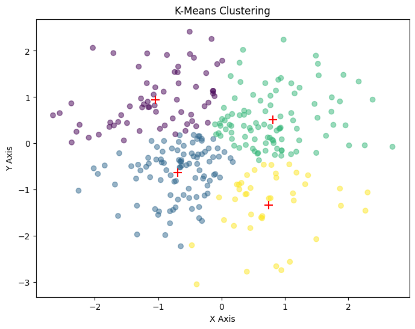

## K-means Clustering Implementation with scikit-learn

# Overview
This note demonstrates the implementation of the K-means clustering algorithm using the `scikit-learn` library. It highlights the ease of use and efficiency of scikit-learn for performing cluster analysis on a dataset.


## Dependencies
- NumPy
- Matplotlib
- scikit-learn

## Implementation Details

The implementation consists of several main components:

1. Data Generation and Definition for Number of Clusters
```python
import numpy as np
import matplotlib.pyplot as plt
from sklearn.cluster import KMeans

k = 4
np.random.seed(0)
data = np.random.randn(300, 2)
```
First, the code imports the necessary libraries. `numpy` is imported as `np`, which is a common alias used to simplify the usage of the library. NumPy is a powerful library for numerical computing in Python, providing support for arrays, matrices, and many mathematical functions. `matplotlib.pyplot` is imported as `plt`, another common alias. Matplotlib is a plotting library used for creating static, interactive, and animated visualizations in Python. `KMeans` is imported from `sklearn.cluster`, which provides the K-means clustering implementation.

Next, the variable `k` is defined and set to `4`. This variable represents the number of clusters that the K-means algorithm will attempt to find in the dataset. K-means clustering is an unsupervised learning algorithm that partitions a dataset into k distinct, non-overlapping subsets (clusters).

The line `np.random.seed(0)` sets the seed for NumPy's random number generator. Setting the `seed` ensures that the random numbers generated are reproducible, which is important for debugging and consistency in experiments. By using the same seed, you can ensure that the same random numbers are generated each time the code is run.

Finally, the `data` variable is created using `np.random.randn(300, 2)`. This function generates a 300x2 array of random numbers drawn from a standard normal distribution (mean of 0 and standard deviation of 1). This array represents the dataset that will be used for clustering. Each row in the array corresponds to a data point with two features.

2. Implementing K-means Clustering with scikit-learn
```python
kmeans = KMeans(n_clusters=k, random_state=0)
kmeans.fit(data)
labels = kmeans.labels_
centroids = kmeans.cluster_centers_
```
The `KMeans` class from `scikit-learn` is used to create a K-means clustering model. The `n_clusters` parameter is set to `k`, specifying the number of clusters, and `random_state=0`ensures reproducibility.

The `fit` method is called on the kmeans object with the data as the argument. This method performs the K-means clustering algorithm on the dataset, finding the optimal cluster assignments and centroids.

The `labels` attribute of the kmeans object contains the cluster assignments for each data point, and the `cluster_centers_` attribute contains the coordinates of the `centroids`.

3. Visualizing the Clustering Results
```python
def plot_data(data, centroids, labels, iteration):
  plt.figure(figsize=(8,6))
  plt.scatter(data[:, 0], data[:, 1], c=labels, alpha=0.5, cmap='viridis')
  plt.scatter(centroids[:, 0], centroids[:, 1], c='red', s=100, marker='+')
  plt.title(f"K-Means Clustering")
  plt.xlabel("X Axis")
  plt.ylabel("Y Axis")
  plt.show()

plot_data(data, centroids, labels, iteration=kmeans.n_iter_)
```

The function `plot_data` takes four parameters: `data`, `centroids`, `labels`, and `iteration`. The `data` parameter represents the dataset, `centroids` represents the current positions of the centroids, `labels` contains the cluster assignments for each data point, and `iteration` indicates the current iteration number of the K-means algorithm.

Inside the function, `plt.figure(figsize=(8, 6))` creates a new figure with a specified size of 8x6 inches. This sets up the plotting area for the visualization.

The function then creates a scatter plot of the data points using` plt.scatter(data[:, 0], data[:, 1], c=labels, alpha=0.7, cmap='viridis')`, where the color of each point corresponds to its cluster assignment. The `alpha=0.5` parameter sets the transparency level of the points, and `cmap='viridis'` specifies the colormap to use for coloring the points.

Next, `plt.scatter(centroids[:, 0], centroids[:, 1], c='red', s=100, marker='+')` adds a scatter plot of the centroids to the same figure. The `centroids` are plotted as red `+` markers with a size of `100`.

The function then sets the title of the plot to indicate the current iteration using plt.title`(f"K-Means Clustering")`. It also labels the x-axis and y-axis with `plt.xlabel("X Axis")` and `plt.ylabel("Y Axis")`, respectively.

Finally, `plt.show()` displays the plot.

`The last line, `plot_data(data, centroids, labels, iteration=kmeans.n_iter_)`, calls the plot_data function with the `data`, `centroids`, `labels`, and the number of iterations taken by the K-means algorithm to converge. This generates and displays the final plot of the data points and centroids after the K-means algorithm has been performed.

## Running the Code
```
python kmeans_sklearn.py
```
## Output
The script generates a plot showing


## Key Differences Between Numpy and Scikit-Learn for K-Means

| Aspect | NumPy Implementation | Scikit-learn Implementation |
|--------|---------------------|----------------------------|
| **Implementation Complexity** | Requires explicit coding of clustering algorithm steps | Provides high-level, optimized implementation |
| **Performance** | Performance depends on manual implementation efficiency | Optimized C++ implementation with better performance |
| **Features** | Basic implementation with manual control | Additional features including:<br>- k-means++ initialization<br>- Multiple initialization runs<br>- Convergence metrics<br>- Inertia calculation |
| **Visualization** | Shows intermediate steps | Shows final result only |
| **Flexibility** | Can be modified for educational purposes | Black-box implementation but more robust |

## When to Use Each Implementation

| Use Case | NumPy | Scikit-learn |
|----------|-------|--------------|
| **Educational Purposes** | ✅ Learning K-means algorithm<br>✅ Teaching/demonstrating steps<br>✅ Algorithm modification<br>✅ Visualizing intermediate steps | ❌ Black-box implementation |
| **Production Usage** | ❌ Limited optimization<br>❌ Basic features | ✅ Production-ready code<br>✅ Optimal performance<br>✅ Additional features<br>✅ Large dataset handling<br>✅ Robust implementation |

> Note: ✅ indicates recommended use case, ❌ indicates not recommended